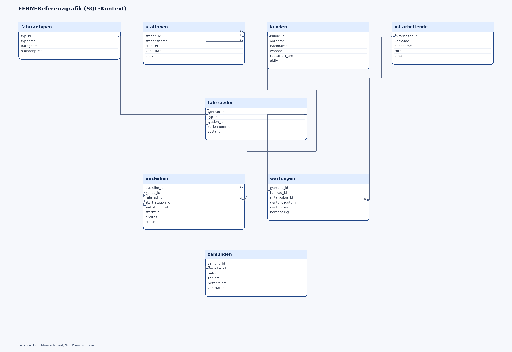

# Musterklassenarbeit (60 Minuten)

## Punkteumfang aus den Vorgaben

Gegeben:
- Gesamtpruefung: 210 Minuten
- 3 Aufgabenteile mit je 40 Punkten
- Gesamtpunkte der Pruefung: 120

Herleitung für 60 Minuten:

120 * (60 / 210) = 34,29 -> gerundet 34 Punkte

## Struktur (3 Aufgabenteile)

| Teil | Inhalte | Punkte | Zeit |
|---|---|---:|---:|
| A | Theorie (MC) | 3 | 5 Min |
| B | EERM, Normalisierung, Anomalien | 14 | 25 Min |
| C | SQL-Abfragen über viele Tabellen | 14 | 25 Min |
| D | Grundlagen Programmierung (Struktogramm) | 3 | 5 Min |
| Gesamt |  | 34 | 60 Min |

## Teil A (3 Punkte)

### Aufgabe 1: Theorie (Multiple Choice) – 3 Punkte
Markieren Sie richtig/falsch. (0,5 Punkte je Aussage)

1. Ein Fremdschluessel darf mehrfach vorkommen.
2. Eine N:M-Beziehung wird in relationalen Modellen direkt ohne Zwischentabelle gespeichert.
3. Ein LEFT JOIN kann Datensaetze ohne Partner auf der rechten Seite sichtbar machen.
4. Die 3NF reduziert Redundanz und Anomalien.
5. Ein Primarschluessel darf NULL sein.
6. HAVING filtert Gruppen nach GROUP BY.

## Teil B (14 Punkte): EERM in MySQL Workbench

Wichtig didaktisch:
- Teil B ist eine reine Modellierungsaufgabe.
- Es wird bewusst kein fertiges SQL-Schema vorgegeben.
- Die Struktur muss von den Schülerinnen und Schülern selbst aus dem Sachverhalt entwickelt werden.

### Aufgabe 3.1: EERM modellieren – 8 Punkte
Sachverhalt Modellierung (Kontext 1):
Eine Bildungseinrichtung betreibt eine Kursplattform. Teilnehmende buchen Kurse zu konkreten Terminen. Lehrkräfte betreuen Kurse, zum Teil im Team. Die Schulleitung benötigt später Auswertungen zu Buchungen pro Person, Terminen pro Kurs und Lehrkräften ohne aktive Zuordnung.

Auftrag:
Leiten Sie aus dem Sachverhalt ein geeignetes EERM in MySQL Workbench ab. Begründen Sie Ihre Modellierungsentscheidungen kurz.

### Aufgabe 3.2: Normalisierung bis 3NF – 4 Punkte
- Benennen Sie 2 funktionale Abhaengigkeiten
- Begruenden Sie, warum das Modell in 3NF liegt

### Aufgabe 3.3: Anomalien – 2 Punkte
Nennen Sie je ein Beispiel:
- Einfügeanomalie
- Änderungsanomalie
- Löschanomalie

## Teil C (14 Punkte): SQL-Abfragen über viele Tabellen

Separater SQL-Kontext (3NF, Kontext 2):
Für Teil C wird absichtlich ein anderen Kontext als in Teil B verwendet, damit die Modellierungsloesung aus Teil B nicht indirekt vorgegeben wird.

Konkreter Sachverhalt:
Ein kommunaler Stadtfahrradverleih verwaltet Kundinnen und Kunden, Stationen, Fahrradtypen, einzelne Fahrräder, Ausleihen, Zahlungen und Wartungen. Die bereitgestellte Übungsdatenbank ist bereits in 3NF modelliert.

Arbeitsgrundlage:
- SQL-Dump: KA02_BG12_2025_60min_34P_schema_data_dump.sql
- EERM-Datei (Lehrkraft/Qualitätssicherung): KA02_BG12_2025_60min_34P_SQLDB_EERM.mwb
- Workbench-Grafik (falls vorhanden): KA02_BG12_2025_60min_34P_SQLDB_EERM.png

### Aufgabe 4.1 (4 Punkte)
Geben Sie für jede abgeschlossene Ausleihe den Kundennamen, die Fahrradnummer, den Fahrradtyp, Start- und Zielstation sowie den Zahlbetrag aus.
Sortierung: Kundennachname, Startzeit.

### Aufgabe 4.2 (4 Punkte)
Ermitteln Sie je Kundin/Kunde die Anzahl abgeschlossener Ausleihen. Zeigen Sie nur Personen mit mindestens 2 abgeschlossenen Ausleihen.

### Aufgabe 4.3 (3 Punkte)
Geben Sie pro Station den letzten Ausleihstart und die Anzahl unterschiedlicher Kundinnen/Kunden aus, die dort gestartet sind.

### Aufgabe 4.4 (3 Punkte)
Finden Sie Mitarbeitende ohne dokumentierte Wartung (LEFT JOIN).

## Modellgrafik Teil C

## Teil D (3 Punkte): Grundlagen Programmierung

### Aufgabe 2: Struktogramm (am Ende bearbeiten)
Erstellen Sie ein Struktogramm für folgende Logik (BPE 5.1):
- Eingabe: Punktezahl einer Teilleistung
- Gueltig sind Werte von 0 bis 15
- Bei ungueltiger Eingabe erneut abfragen
- Bei gültiger Eingabe: "Eingabe gültig"

Wichtig:
- Keine Arrays und keine Listen verwenden (Arrays/Listen gehoeren zu BPE 7).
- Fokus auf Eingabe, Bedingung, Schleife und Ausgabe.

Bewertung:
- Logik: 1,5
- Strukturblocke: 1,0
- Lesbarkeit: 0,5

## Abgabe

- EERM-Modellierung Teil B (von Schülerinnen und Schülern erstellt): KA02_BG12_2025_60min_34P_EERM_SCHUELER.mwb
- SQL-Dump Teil C: KA02_BG12_2025_60min_34P_schema_data_dump.sql
- EERM SQL-Kontext Teil C (Lehrkraft): KA02_BG12_2025_60min_34P_SQLDB_EERM.mwb
- SQL-Loesungen als Datei oder Text

## Kurzloesungsschluessel (Lehrkraft)

Aufgabe 1: r, f, r, r, f, r

Beispiellogik für Teil C:
- 4.1 benötigt JOIN über mindestens: ausleihen, kunden, fahrraeder, fahrradtypen, stationen, zahlungen
- 4.2 benötigt GROUP BY/HAVING auf kunden + ausleihen
- 4.3 benötigt Aggregation pro station + MAX(startzeit)
- 4.4 benötigt LEFT JOIN mitarbeitende -> wartungen und IS NULL
